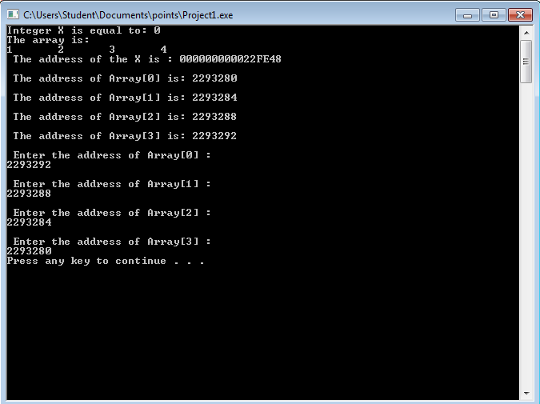

# lbyec72-ej1-p4-pointers-angelanebres
lbyec72-ej1-p4-pointers-angelanebres created by GitHub Classroom

June 28

I was able to store the address. It also asks for the address of the elements of the array

 

